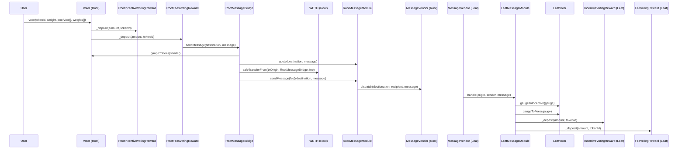
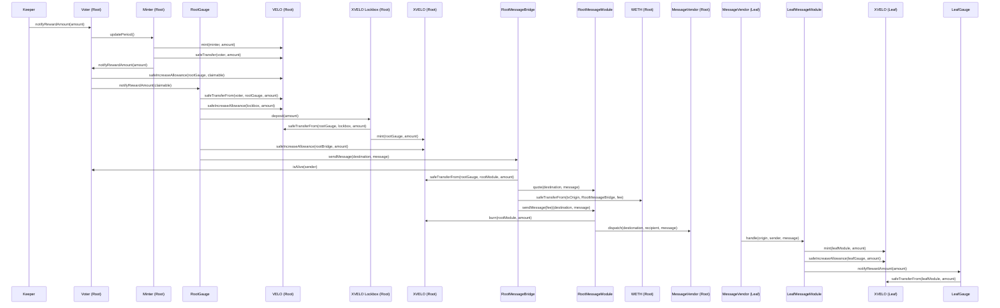

# Superchain

The Superchain contracts in this repository extend the Velodrome ecosystem beyond OP Mainnet to the 
rest of the Superchain. Protocols and users on other chains will be able to benefit from 
participating in the Velodrome ecosystem. 

## Nomenclature

- The _root_ chain refers to the main chain that the Velodrome protocol exists on. This is currently 
OP Mainnet.
- The _leaf_ chain refers to any chain that Velodrome expands to. 
- A _pool_ refers to any pool type currently supported by Velodrome (e.g. vAMM/sAMM, slipstream etc).
- A _gauge_ refers to any gauge type currently supported by Velodrome.
- A contract is considered a _trusted_ contract if it is registered on a voter on root or leaf or on
the factory registry on root.

## Flow

The Superchain release does not change the flow or mechanics of Velodrome V2.

Every pool on the leaf chain will have a root pool (see `interfaces/root/pools/IRootPool.sol`).
The leaf chain pool will also have a gauge if the root pool has one (see `interfaces/root/gauges/IRootGauge.sol`).
The root pool is a placeholder and it is used by the Voter to maintain a registry of the created pools 
and gauges.

The root pool does not allow liquidity deposits. The root gauge's sole purpose is to facilitate the
forwarding of emissions from the root chain to the leaf chain.

The creation of a root gauge will trigger the creation of a leaf gauge. This is the only way a leaf 
gauge can be created. If a leaf pool does not exist, it will be created along with the leaf gauge.

The leaf gauges accept incentives and accrue fees for every epoch, following the existing protocol mechanics.

Votes for root gauges will be forwarded to the leaf gauges for accounting purposes.
On epoch flip, emissions for the leaf gauges will be received by the root gauges.
Root gauges will wrap VELO emissions into XVELO before bridging it to the leaf chain to be deposited
into the leaf gauges.

Leaf pool liquidity providers with staked deposits will accrue and claim XVELO emissions.

XVELO will be used as the emissions token across the Superchain.

See more information on the Superchain flow in the E2E test at `test/e2e/concrete/gaugeFlow/GaugeFlow.t.sol`.

## Features

New features have been added. They will be described based on where the originating transaction 
takes place, even if there may be side effects on other chains.

There is a new bridgeable token XVELO. This token can be redeemed 1:1 for VELO on the root chain. 

### Root

- A user will be able to create a gauge on a leaf chain by calling `createGauge` on the `Voter` on 
root.
- A user will be able to vote for gauges on other chains. 
- A user will be able to claim voting rewards on the leaf chain.
- Emissions can be streamed to a gauge on the leaf chain.
- Leaf chain gauges will have their maximum weekly emissions capped. This cap is modifiable.
- A user will be able to bridge XVELO to any other chain with a live Superchain deployment.

### Leaf

- A user will be able to claim gauge rewards (emissions).
- A user will be able LP in a pool and stake their LP tokens / nft in a gauge to earn emissions.
- A user will be able to bridge XVELO to any other chain with a live Superchain deployment.
- Protocols will be able to deposit incentives for voters on the leaf chain.

### Miscellaneous

Most contracts in this repository will be deployed via [CREATEX](https://github.com/pcaversaccio/createx).
This is available on many chains already and will be available as a [preinstall](https://github.com/ethereum-optimism/specs/blob/8106c9d8b358aea863cd30d1cccc403466b63bc6/specs/protocol/preinstalls.md?plain=1#L162) on the Superchain.

The following contracts are deployed via CREATE3:
- vAMM/sAMM pool implementation
- vAMM/sAMM pool factory
- Gauge factory
- Gauges
- Voting rewards factory
- XERC20Factory, XERC20Lockbox and XERC20 contract
- TokenBridge
- MessageBridge
- Hyperlane Message Module
- Router
- LeafVoter (this contract does not have the same address as the root voter)

As contracts are deployed via CREATE3, the implementation for the leaf chains must be reviewed before 
it is enabled. This is because the code at the address could be different. The expectation is that 
the root chain will run root code (housed in the `root` folder) and the leaf chains will all 
operate the same leaf code. If there are differences in leaf chain code, it may be to support features
not available on other chains (e.g. gas fee sharing).

Token whitelisting for leaf chains is different from the root chain. Tokens are automatically 
whitelisted when a corresponding gauge is created and unwhitelisted when the gauge is killed. For a 
token to be whitelisted, it must exist as a token in at least one live gauge on the leaf chain.

The bridge uses a message module pattern, allowing for the messaging mechanism to be replaced on a 
per-chain basis. The goal is to eventually move towards native interop, when it becomes available on 
the leaf chain.

There is a new emergency council contract that acts as a wrapper around the existing emergency council.
This allows it to kill and revive gauges on the leaf chain. It will no longer be possible to use the 
emergency council on the voter for other purposes.

### Message Bridge

Superchain contracts on the root chain push messages to the leaf chain via the bridge. The contracts
encode a payload, which is then passed to the bridge. The bridge uses the root `Voter` or 
`FactoryRegistry` contracts to verify that the sender is a trusted contract before forwarding 
the payload to the module.

The module then engages with the messaging vendor to send the message to the leaf chain. Currently, 
the message module supports cross chain message passing via Hyperlane. 

Gas payments for cross chain transactions are currently paid for by the original sender on the root 
chain in WETH, representing the wrapped token of what OP Mainnet uses for gas fees. 
In the future, it may be possible to add middleware to allow for a sponsor to pay for gas fees.

The diagram below shows the flow of messages from the root chain to the leaf chain. Most message 
flows follow the same general pattern, but may have different intermediary contracts and destination 
contracts. The following example assumes the voter has never voted before.

Assume that any pool and gauge contracts are interchangeable with any other pool and gauge type (e.g.
vAMM/sAMM, slipstream etc).

`origin` refers to the chainid that the message originated from.
`destination` refers to the chainid that the message is being sent to.

Note the usage of `Voter` as the canonical source of truth for valid message senders.

As another example, this is `notifyRewardAmount` (called via `Voter.distribute()). 

Some assumptions were made to simplify the diagram.
- Calls related to Velodrome Minter that are unrelated to the cross chain emissions flow have been excluded.
- Emissions are assumed to be within the limit.

#### Message Components

Messages are a byte array that is `abi.encodePackd` with arguments required to execute each command.

The first byte of a message is the command. The second 20 bytes will be an address. This address is
typically used for validation that the sender is authorized. Any subsequent bytes are required for
the command to execute.

Messages apart from `getReward` should never revert (i.e. be dropped by the message vendor) on the leaf chain.

##### Deposit & Withdraw
This payload consists of:
- 1 byte command
- 20 byte gauge address
- 32 byte amount
- 32 byte token id

##### Get Incentives & Get Fees
This payload consists of:
- 1 byte command
- 20 byte gauge address
- 20 byte recipient address
- 32 byte token id
- 1 byte tokens array length
- 0 - 160 bytes of token addresses

##### Create Gauge
This payload consists of:
- 1 byte command
- 20 byte pool factory address
- 20 byte voting rewards factory address
- 20 byte gauge factory address
- 20 byte token0 address 
- 20 byte token1 address
- 3 byte pool parameter

##### Notify Reward & Notify Reward Without Claim
This payload consists of:
- 1 byte command
- 20 byte gauge address
- 32 byte amount

##### Kill Gauge & Revive Gauge
This payload consists of:
- 1 byte command
- 20 byte gauge address

#### Message Invariants
- Messages will only ever be sent by contracts verified as part of the Velodrome protocol.
- Voting messages (i.e. those that trigger the `DEPOSIT` and `WITHDRAW` commands) must be processed
 sequentially and must never revert.
- Any other messages sent by trusted contracts can be processed concurrently and in any order.
- Messages should never revert in a way that prevents the message from ever being processed.

## Contracts

The following contracts store state that verifies that a contract is part of the Velodrome ecosystem.
- The `Voter` contract on both root and leaf chains (`LeafVoter`). 
- The `FactoryRegistry` contract on the root chain.

Any contract that is registered on these two contracts will be able to send and receive messages.

### Root

#### Root Message Bridge
- Supports the addition of modules used to send messages cross chain. These modules cannot be removed.
- Supports the registering of new chains. Only the owner can register new chains. A module must be 
registered with the chain.
- Supports the deregistering of chains. Only the owner can deregister chains.
- Supports the setting of a module for a chain. This allows chains to communicate with each other
via different message vendors. Care must be taken in the upgrade process.
- Supports the sending of arbitrary messages by trusted Velodrome contracts.
- Supports payment of fees via WETH.

#### Root Hyperlane Message Module
- Supports the sending of messages cross chain via Hyperlane.
- For token bridging transactions, the module is given permission to burn tokens on the root chain.

#### Token Bridge
- Supports the sending of tokens cross chain via Hyperlane.
- Fees are paid for in native ETH. 
- The token bridge may be sunset in the future in favor of alternate token bridging mechanisms.

#### Root Pool Factory
- Supports the creation of pools on the root chain for tokens on other chains. 
- The same pool factory can be reused for all leaf chains.
- Cannot create pools on the root chain.
- The interface of this pool deviates from that of v2 and slipstream pool factories.

#### RootPool
- A placeholder pool. Stores chainid and token addresses associated with the pool. 

#### Root Gauge Factory
- Supports the creation of gauges on the root and leaf chain for tokens on other chains.
- Automatically creates a pool on the leaf chain if it does not already exist.
- Supports the setting of emission caps for gauges created by this factory.
- Supports the setting of a default emission cap for gauges created by this factory.
- Supports the setting of a notify admin. This admin will be able to add additional emissions to 
leaf gauges.

#### Root Gauge
- Emissions received by the root gauge from voter will be deposited into the corresponding leaf gauge 
via the message bridge.
    - Emissions in excess of the cap as defined in the gauge factory are returned to the minter.
- Emissions received by the root gauge from the notify admin will be deposited into the corresponding 
leaf gauge via the message bridge.

#### RootVotingRewardsFactory
- Supports the creation of incentive and fee voting rewards contracts on the root chain. 
- Supports the designation of a recipient for rewards on other chains. 
  - Rewards contracts will use this recipient if it is set.
  - A recipient _must_ be set for if one wishes to call `vote` or call `getReward` for a veNFT owned
  by a contract.

#### RootIncentiveVotingRewards 
- Supports the claiming of rewards from reward contracts on the leaf chain.
  - Rewards will be sent to the owner of the nft by default, but can be sent to any recipient. 

#### RootFeesVotingRewards
- Supports the depositing and withdrawing of voting weights to both incentive and fee contracts on the leaf chain.
- Supports the claiming of rewards from reward contracts on the leaf chain.
  - Rewards will be sent to the owner of the nft by default, but can be sent to any recipient. 

#### Emergency Council
- Can do all existing tasks that the emergency council can do (e.g. kill / revive gauges etc). 
- Can kill / revive gauges on the leaf chain via the message bridge.

### Leaf

#### LeafVoter
- Supports the creation of gauges on the leaf chain via the message bridge.
- Supports the killing of gauges on the leaf chain via the message bridge.
- Supports the revival of gauges on the leaf chain via the message bridge.
- Supports the claiming of rewards for gauges on the leaf chain.
- Maintains a list of whitelisted tokens based on live gauges.

#### Pool, PoolFactory
- Vanilla Velodrome vAMM / sAMM pool and pool factory contracts.

#### LeafGaugeFactory
- Supports the creation of gauges on the leaf chain via the message bridge.
- Gauges are created with CREATE3, ensuring that they have the same address on the leaf chain and 
root chain.

#### LeafGauge
- Vanilla Velodrome vAMM / sAMM gauge contracts.
- Lightly modified to support emissions deposited from the root chain.

#### IncentiveVotingRewards, FeesVotingRewards, VotingRewardsFactory
- Vanilla Velodrome rewards contracts.
- Lightly modified to support the recording of vote weights from the root chain.
- Lightly modified to support the collection of rewards from the root chain.

## XERC20

The XERC20 implementation is a lightly modified version of the XERC20 implementation used by Moonwell,
available [here](https://github.com/moonwell-fi/moonwell-contracts-v2/tree/main/src/xWELL). The
implementation deviates from the standard XERC20 implementation in the following ways:

- Limits are managed by using a two sided buffer.
- The structs used to manage bridge limits have been modified.
- The function `setLimits(bridge, mintingLimit, burningLimit)` is now `setBufferCap(bridge, newBufferCap)`
and `setRateLimitPerSecond(bridge, newRateLimitPerSecond)`.

In addition to the above changes, our XERC20 implementation includes a lockbox and an XERC20Factory, 
that uses CREATE3 to deploy the XERC20 contracts. This ensures the contract has the same address on
all chains.

The XERC20 implementation has also been lightly modified to support [SuperchainERC20](https://github.com/ethereum-optimism/specs/blob/main/specs/interop/token-bridging.md). A sample implementation is available [here](https://github.com/defi-wonderland/optimism/blob/develop/packages/contracts-bedrock/src/L2/SuperchainERC20.sol). This interface is
also rate limited as per XERC20.
